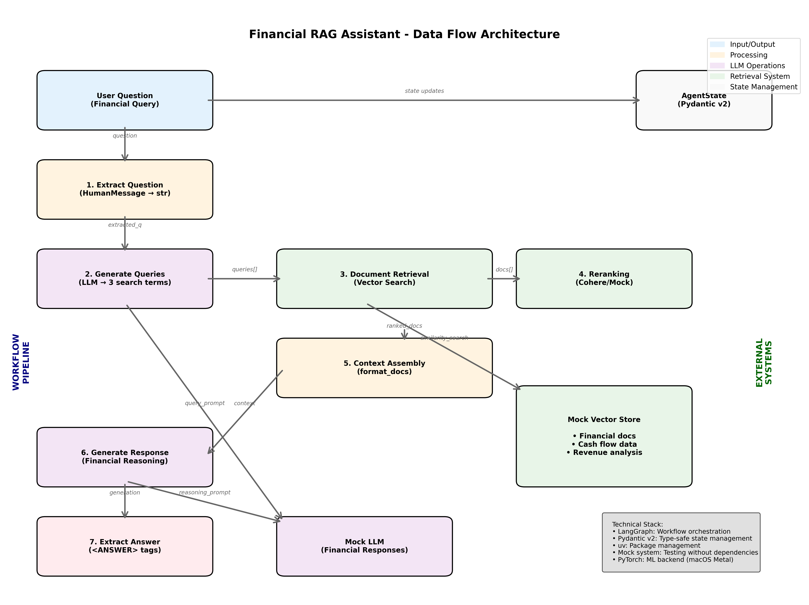
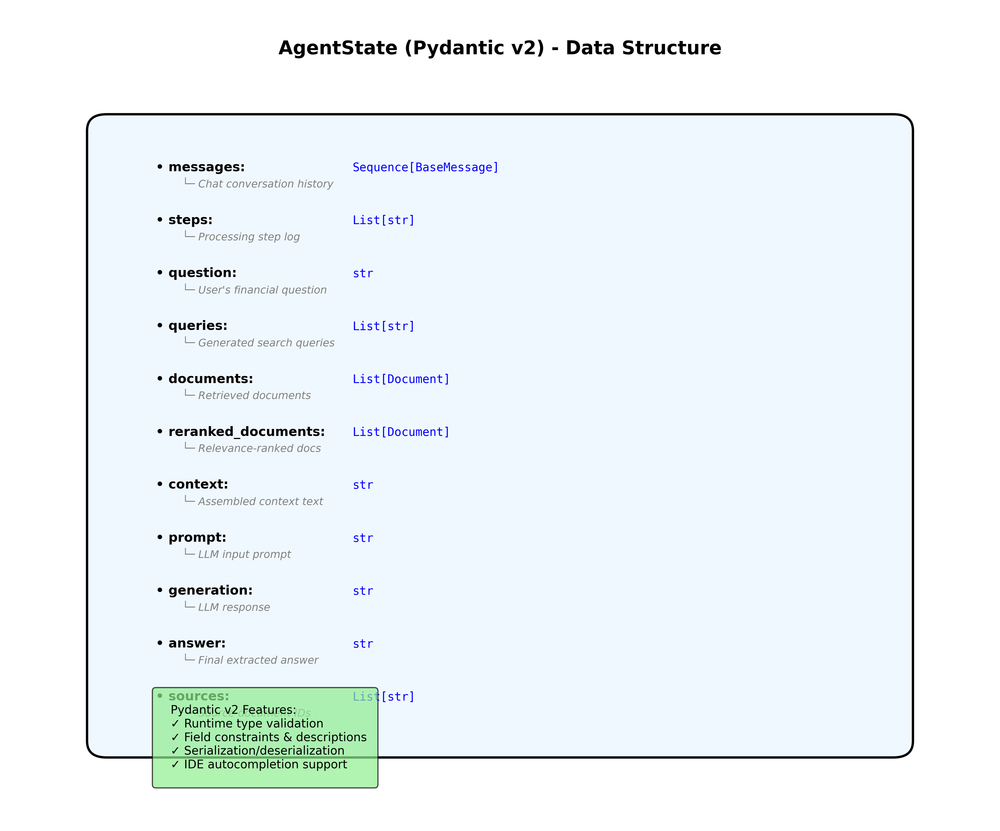

# Financial RAG Agent

A streamlined ConvFinQA RAG (Retrieval-Augmented Generation) testing pipeline using mock dependencies for rapid development and validation. This refactored codebase focuses on testing workflow functionality with minimal external dependencies.

## Architecture Overview



### Core Components

- **LangGraph Workflow**: Multi-node graph orchestrating the complete RAG pipeline
- **Pydantic v2 State**: Type-safe state management with validation and constraints  
- **Mock System**: Complete testing without external LLM/vector DB dependencies
- **Minimal Dependencies**: Only 4 essential packages for cross-platform compatibility

### Data Flow Pipeline

```
User Question → Extract Question → Generate Queries → Document Retrieval → 
Context Assembly → LLM Generation → Answer Extraction → Final Answer
```

1. **Question Extraction** → Extract user question from input messages
2. **Query Generation** → Generate 3 search queries using mock LLM
3. **Document Retrieval** → Mock vector similarity search with financial document stubs
4. **Context Assembly** → Format retrieved documents into structured context
5. **LLM Generation** → Mock financial reasoning with step-by-step analysis
6. **Answer Extraction** → Parse final answer from mock LLM response



## 📁 Project Structure

```
financial-rag-test/
├── test_workflow.py          # Main end-to-end test runner
├── config.py                # Pydantic v2 configuration schema
├── requirements.txt          # Minimal cross-platform dependencies
├── workflow/
│   ├── state.py             # Pydantic v2 AgentState model
│   └── nodes_test.py        # Test workflow nodes with mock dependencies
├── models/
│   └── llm_stub.py          # Mock LLM for testing
├── data/
│   └── retrieve_stub.py     # Mock document retrieval system
└── utils/
    ├── prompts.py           # Prompt templates
    └── utils.py             # Utility functions
```

### Dependencies 

- **pydantic>=2.0.0** - Type-safe configuration and state management
- **langchain-core>=0.1.0** - Core LangChain components (messages, documents)
- **langgraph>=0.0.30** - Workflow orchestration framework
- **python-dotenv>=1.0.0** - Environment variable handling

## 🧪 Testing

### Run End-to-End Test

```bash
python test_workflow.py
```

### Expected Output

```
Starting Financial RAG Workflow End-to-End Tests
============================================================
Testing individual workflow nodes...

-1 Testing extract_question...
   ✓ Extracted question: What was the percentage change in the net cash fro...

-2 Testing generate_queries...
   ✓ Generated 3 queries

-3 Testing retrieve...
   ✓ Retrieved 5 documents
   ✓ Context length: 603 characters

-4 Testing generate...
 Generated response

-5 Testing extract_answer..
Final answer: 29.31%

All individual nodes working!

Testing complete workflow pipeline...
Complete workflow successful!

Testing with different question types...
Multiple question types working!

============================================================
ALL TESTS PASSED!
The financial RAG workflow is working end-to-end
Final test result: 29.31%
```

## Configuration

The system uses Pydantic v2 for type-safe configuration in `config.py`:

```python
class GraphConfig(BaseModel):
    retrieval_k: int = 5          # Documents to retrieve
    rerank_k: int = 3             # Documents to rerank  
    max_tokens: int = 4096        # Max generation tokens
    temperature: float = 0.0      # Generation temperature
    top_p: float = 0.9           # Top-p sampling
```

---

*This is a refactored, test-focused version of a larger financial RAG system. The complete implementation with training, evaluation, and production components has been streamlined to focus on core workflow testing functionality.*
